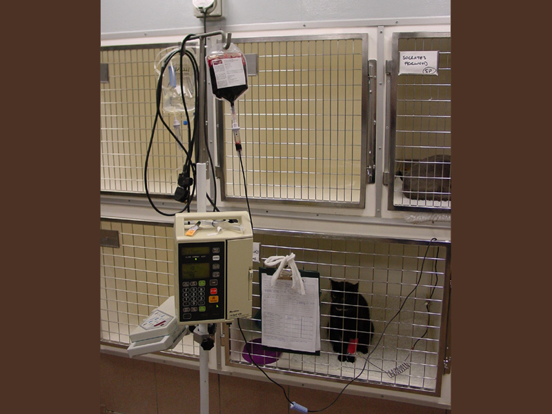
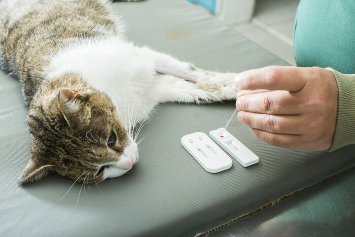
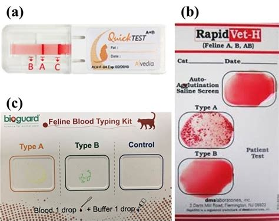

= [2021-07-19] Transfuziile de sânge pentru pisici
:docinfo: shared
:date: 2021-07-19
:toc: macro

== Notă importantă

[.red]
Pentru pisicile-receptoare e vital să primească doar sânge compatibil.
Chiar şi o cantitate mică de sânge incompatibil poate cauza moartea.

A se vedea secţiunea <<grupe>>.

Injectarea sângelui trebuie sa fie facută cu debit foarte mic (pe parcursul mai multor ore) şi cu atentă supraveghere medicală.

(Imagine preluată din pagina https://www.vetstream.com/treat/felis/technique/blood-transfusion[].)

== Scopul acestui document

Anemia înseamnă oxigenare redusă a ţesuturilor/organelor.
Adesea e determinată de deficit de Globule Roşii
(celule din sânge care au funcţia de a transporta Oxigenul către ţesuturi/organe -- practic de a le menţine vii).

Formele uşoare ale Anemiei cauzează oboseală şi stare de slăbiciune.
Formele grave ale Anemiei pun în pericol imediat viaţa pacientului, reprezentând urgenţe medicale.

Transfuziile de sânge pot face o diferenţă enormă:

- corectând rapid, în regim de urgenţă, Anemia;
- menţinând pisica în viaţă până la determinarea-şi-corectarea cauzei din spatele Anemiei.

Există (chiar mai pregnant decât în medicina umană)
prea mulţi pacienţi care au nevoie de sânge
şi prea puţini donatori care să fie aduşi la Cabinete Veterinare pentru a le fi recoltat sânge.

Acest document se adresează proprietarilor de pisici pentru a îi încuraja:

- să îşi înscrie pisicile pe listele de donatori menţinute de Cabinetele Veterinare;
- [red]#să răspundă apelurilor Cabinetelor, transportându-şi la nevoie pisicile la Cabinete pentru a fi testate şi pentru a le fi recoltat sânge
(ajutând astfel pisicile bolnave)#;
- să menţină, pentru fiecare pisică-donatoare, evidenţa donaţiilor, testelor şi vaccinurilor
(evitând astfel ca o pisică să doneze prea des sau după vârsta de 8 ani).

toc::[]

== Transfuziile în medicina veterinară

[red]#Pentru oameni#, prima transfuzie de sânge documentată a avut loc în 1818,
iar transfuziile de sânge au fost adoptate pe scară largă în anii 1920-1930
când au fost introduse substanţele anti-coagulante (ceea ce a permis stocarea sângelui şi crearea băncilor de sânge).
Medicina transfuziilor de sânge uman s-a dezvoltat într-o ştiinţă foarte avansată.

[red]#În medicina veterinară#,
transfuziile pot avea un rol la fel de important în situaţiile de urgenţă şi de terapie intensivă -- pot salva vieţile pacienţilor.

Dar, [red]#pentru animale#, transfuziile sunt efectuate mai rar deoarece:

- există prea puţini donatori care să fie aduse (de către proprietari) la Cabinete în caz de nevoie;

- unii donatori necesită uneori o sedare uşoară pentru a le putea fi recoltat sânge;

- uneori, vieţile animalelor nu sunt percepute ca fiind la fel de importante ca vieţile oamenilor.

[red]#Pentru pisici# (spre deosebire de câini), apare în plus:

- dificultatea stocării pe termen lung a sângelui.

Totuşi, există şi [red]#veşti bune#:

- Numărul Cabinetelor şi cadrelor medicale care au experienţă în Transfuziile de sânge a crescut semnificativ.

- Procentul pisicilor-donatoare care nu necesită sedare a crescut (inclusiv ca urmare a acumulării experienţei de către Cabinete).

- Distribuţia disproporţionată a grupelor de sânge funcţionează, cel mai adesea, în favoarea pacienţilor:

* - cel mai adesea, pisica-bolnavă necesită sânge de grupa A;
* - chiar dacă nu e cunoscută grupa de sânge a pisicii-potenţial-donatoare, ar fi bine să răspundem apelului ducând pisica la Cabinet;
* - iniţial, îi e recoltată iniţial o cantitate foarte mică de sânge pentru a îi fi testată grupa;
* - cel mai adesea, grupa se dovedeşte a fi A şi va putea dona sânge pentru acest pacient;
* - dacă însă grupa se dovedeşte a fi B, chiar dacă nu poate dona sânge pentru acest pacient, a fost descoperită o Comoară -- o pisică extrem de rară care va putea ajuta cazurile disperate în care şi pisica-bolnavă are grupa B.

== Ce elemente sunt oferite pisicii-bolnave prin Transfuzii ?

În Tranfuziile de sânge, principalele elemente care sunt oferite pisicii-bolnave sunt:

- Globule Roşii;
- Plasmă;
- Trombocite.

În medicina umană,
sângele donat e adesea separat în aceste trei componente
astfel încât fiecare componentă să poată fi folosită individual în funcţie de necesităţile pacienţilor
(având în vedere şi criteriile diferite de compatibilitate pentru Globule Roşii faţă de cele pentru Plasmă).

În medicina veterinară,
separarea sângelui în componente,
deşi e uneori folosită la Transfuziile între câini,
e mai rară la Transfuziile între pisici.

Unul dintre motive e nu putem stoca pe durate nelimitate de timp sângele de pisică (în special Globulele Roşii).
Astfel, pentru o Transfuzie, cel mai adesea trebuie recoltat sânge proaspăt.

=== Globulele Roşii

Globulele Roşii -- ("Red Blood Cells"), numite şi Hematii ("Haematides") sau Eritrocite ("Erythrocytes") --
sunt celule fără nucleu, cu membrana flexibilă, a căror citoplasmă conţine molecule de Hemoglobină,
ele putând astfel transporta Oxigenul către ţesuturi pentru arderile care furnizează energia necesară funcţionării organismului.

Tot Globulele Roşii sunt responsabile pentru transportul al Dioxidului de Carbon (rezultat ca produs secundar al acestor arderi) către plămâni (pentru expirare).

Surplusul de Globule Roşii oferit prin Transfuzii poate ajuta pentru a corecta deficitul de Globule Roşii -- o formă a Anemiei.

=== Plasma

Plasma e componenta lichidă a sângelui (în care sunt suspendate Globulele Roşii).

Plasma conţine numeroase proteine cu funcţii esenţiale:

- Albumina e proteina majoră din sânge, având rolul de a menţine sângele în circulaţie.

- Alte substanţe chimice şi hormoni pot fi transportate prin corp fiind ataşate de Albumină.

- Factorii-de-Coagulare sunt proteine importante care ajută sângele să se coaguleze atunci când un vas de sânge e afectat/deteriorat/distrus.

- O varietate de proteine numite "Mediatori-de-Inflamare" sunt produse în timpul unei inflamaţii pentru a ajuta la combaterea infecţiilor şi pentru a normaliza inflamaţia.

=== Trombocitele

Trombocitele ("Tromobocytes"), numite (în cazul mamiferelor) şi Plateleţi ("Plateletes"),
sunt globule mici din sânge care,
împreună cu Factorii-de-Coagulare (nişte proteine din Plasmă),
au un rol important în coagularea sângelui,
prevenind hemoragia excesivă în cazul diverselor răniri/afecţiuni.

== Ce înseamnă Anemie ?

"Anemie" înseamnă capacitate redusă de oxigenare a ţesuturilor/organelor.
Formele uşoare ale Anemiei cauzează oboseală şi stare de slăbiciune.
Formele grave ele Anemiei pun în pericol imediat viaţa pacientului.

== Care sunt cauzele Anemiei ?

Adesea, Anemia e determinată de deficit de Globule Roşii.

Exemple de afecţiuni care cauzează deficit de Globule Roşii:

- boli cronice (inflamaţii sau infecţii, tumori, Leucemie, boli ale Ficatului, dezechilibre hormonale);

- afecţiuni ale Măduvei Spinării (care e responsabilă de producerea de Globule Roşii);

- Insuficienţa Renală (CKD: Chronic Kidney Disease)
(Rinichii fiind responsabili de producerea Erythroproietinei, un hormon care stimulează producerea de Globule Roşii în Maduva Spinării);

- otrăvirea;

- infecţia cu Bacteria Mycoplasma
(care cauzează o reacţie auto-imună, în care organismul îşi atacă propriile Globule Roşii);

- infecţia cu Virusul Panleukopeniei Feline (FPV)
(care poate cauza atât deficit de Globule Roşii, cât şi deficit de Globule Albe, şi pentru care există uneori şi opţiunea transferului de Albumină Umană);

- infecţia cu Retroviruşi: Virusul Imunodeficienţei Feline (FIV) sau Virusul Leucemiei Feline (FeLV);

- infecţia cu Bacteria Haemo-Bartonella;

- infestaţia masivă cu purici;

- deficienţe de nutriţie (înfometare sau lipsa unor elemente nutritive);

- traumatisme/hemoragii;

- infecţia cu Parazitul Babesioza Felină.

== Cum e diagnosticată Anemia ?

În lipsa aparaturii specifice, Anemia poate fi diagnosticată vizual, prin inspectarea mucoaselor:

- gingii;
- pleoape;
- porţiuni ale pielii.

În mod normal: mucoasele ar trebui să fie roz.
Dar în cazul pisicilor anemice: mucoasele sunt sunt albe.

Pentru diagnosticarea mai exactă,
Medicul Veterinar recoltează pisicii câteva picături de sânge
care sunt apoi utilizate într-un aparat care măsoară
procentul volumetric ocupat de Globulele Roşii în sânge -- HCT (Hematocrit) sau PCV (Packed Cell Volume).

O pisică sănătoasă are Hematocritul între 25% şi 45%.

Dacă Hematocritul e 19% sau mai mic, Medicul stabileşte cel mai adesea că viaţa pisicii e în pericol, impunându-se:

- Transfuzie (sau Transfuzii) pentru a corecta Anemia şi a menţine pisica în viaţă;
- diagnosticarea şi tratarea cauzei din spatele Anemiei (a se vedea secţiunea <<cause>>).

== Cum e obţinut sânge pentru Transfuzie ?

Când o pisică-pacientă necesită Transfuzie, Cabinetul Veterinar:

- efectuează test de grupă de sânge pentru pisica-pacientă;

- consultă registrul de pisici-donatoare, căutând pisici având grupa de sânge compatibilă şi pentru care a trecut suficient timp de la ultima donare.

- sună proprietarii pisicilor respectiv, rugându-i să aducă pisica la Cabinet pentru a îi fi recoltat sânge.

Unele Cabinete Veterinare îngrijesc un număr de pisici. În cazuri de urgenţă, pot recolta sânge de la unele din pisicile proprii.

Adesea, colegi din personalul Cabinetului Veterinar aduc de acasă propriile pisici cărora le e recoltat sânge pentru a ajuta pisicile-bolnave.

[#grupe, Grupele de sânge]
== Grupele de sânge

Grupele de sânge reprezintă principalul criteriu de compatibilitate între pisica-donatoare şi pisica-receptoare.

Există trei grupe de sânge (determinate genetic si menţinute de-a lungul vieţii):

- o pisică având grupa A (foarte des întâlnită) trebuie să primească numai sânge tot de grupa A;

- o pisică având grupa B (foarte rar întâlnită) trebuie să primească numai sânge tot de grupa B;

- o pisică având grupa AB (chiar şi mai rar întâlnită) poate să primească sânge de orice grupă
(fiind totuşi preferate pisicile-donatoare cu grupa A
pentru a păstra pisicile-donatoare cu grupa B -- care sunt extrem de rare -- disponibile pentru pisicile-bolnave cu grupa B).

Grupa de sânge e determinată
folosind un eşantion foarte mic de sânge
şi un dispozitiv de unică folosinţă pentru testarea grupei (care, în anul 2021, costă între 120 RON şi 150 RON).

Trebuie determinate grupele de sânge pentru ambele pisici (cea donatoare şi cea receptoare).

(Imagine preluată din pagina https://allaboutcats.com/cat-blood-transfusion[].)

(Imagine preluată dintr-un site pe care nu mi-l amintesc.)

== Condiţiile pentru ca o pisică să poată dona sânge

Condiţiile ideale ar fi:

- să aibă vârsta între 1 an şi 8 ani;

- să aibă o stare generală bună şi o masă corporală adecvată;

- să fi primit Vaccinurile conform schemei de vaccinare;

- să fie testată infecatarea cu Virusul Imunodeficienţei Feline (FIV) şi Virusul Leucemiei Feline (FeLV);

- să fi trecut suficient de mult timp de la ultima donare de sânge.

== Cât timp trebuie să treacă între două donaţii de sânge ?

Din nefericire, din cauza numărului prea mic de pisici-donatoare disponibile,
adesea cele care sunt duse de proprietari la donat ajung să fie duse prea des.

Dacă mai mulţi proprietari ar accepta ca pisicile lor să doneze sânge la interval,
intervalul dintre donaţii ar putea fi prelungit la 3-4 luni.

E important ca atât Cabinetele, cât şi proprietarii, să menţină evidenţa donaţiilor (e.g.: folosind o foaie scrisă de mână şi prinsă cu un magnet de frigide.

[#cause]
== Importanţa tratării cauzei din spatele Anemiei

Chiar dacă starea unei pisici se îmbunătăţeşte semnificativ (e.g.: în urma primirii unei transfuzii de sânge compatibil),
e vital ca pisica să fie consultată temeinic de un medic veterinar
şi să urmeze un tratament pentru cauza (chiar şi doar prezumtivă) din spatele anemiei.

Starea pisicii trebuie observată atent pe parcursul tratamentului şi trebuie raportată medicului veterinar.

Altfel, starea pisicii se poate degrada rapid
(e.g.: când efectul benefic al transfuziei dispare)
şi pisica se poate anemia din nou şi poate muri.

Adesea trebuie profitat cât mai mult de îmbunătăţirea, chiar şi temporară, a stării pisicii în urma transfuziei.
De exemplu, medicul poate recomanda mâncare cât mai hrănitoare pentru a profita de revenirea, chiar şi temporară, a apetitului.

Un efect des întâlnit al Anemiei e lipsa apetitului, ceea ce în cazul pisicilor e un aspect foarte grav: dacă o pisică nu mănâncă, starea ei se degradează foarte repede.

În unele cazuri, medicul profită de starea îmbunătăţită, chiar şi temporar, pentru a efectua o intervenţie chirurgicală necesară.
Într-adevăr, adesea sunt necesare donaţii de sânge tocmai în vederea unei intervenţii chirurgicale (adesea urgente pentru viaţa pisicii).

== Transfuzie vs Transfuzii

Am înlocuit adesea singularul (e.g.: "Când e necesară o Transfuzie de sânge ?", "O Transfuzie poate salva viaţa…")
cu pluralul (e.g.: "Când sunt necesare transfuziile de sânge ?", "Transfuziile de sânge pot salva vieţile…")
deoarece adesea se întâmplă ca un singur pacient să aibă nevoie de Transfuzii repetate, uneori chiar şi într-un interval scurt de timp.

Un exemplu ar fi cazul unei pisicuţe, atunci în vârstă de 6 luni, infectate cu Virusul Panleukopeniei Feline (FPV),
care a avut nevoie de 10 transfuzii -- evident, de la 10 pisici difeite -- a câte aproximativ 50 ml.
Din fericire, pisicuţa respectivă a reuşit să învingă boala şi a fost foarte sănătoasă apoi.
Numele pisicuţei era Whiskas. (-:

== Contact

Autorul acestui document nu are cunoştinţe medicale.
E important să consultaţi un Medic Veterinar pentru a primi informaţii mai bune.

Corecţii si sugestii pentru îmbunătăţirea acestui document sunt bine-venite (email: adder_2003@yahoo.com).

== Referinţe

- https://icatcare.org/advice/blood-transfusions-in-cats/
- https://www.merckvetmanual.com/cat-owners/blood-disorders-of-cats/red-blood-cells-of-cats
- https://www.vetinfo.com/cencyclopedia/cebloodtype.html
- https://allaboutcats.com/cat-blood-transfusion
- Consultanţă oferită de Ştefania -- o doctoriţă foarte bună şi foarte frumoasă. Ea a dat informaţii corecte, pe care însă e posibil să le fi preluat eu greşit. Erorile îmi aparţin.
